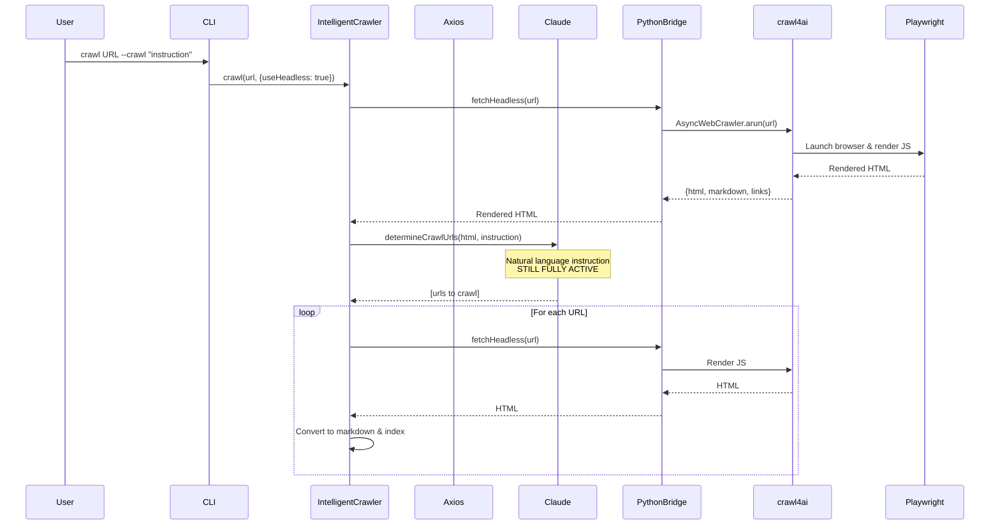
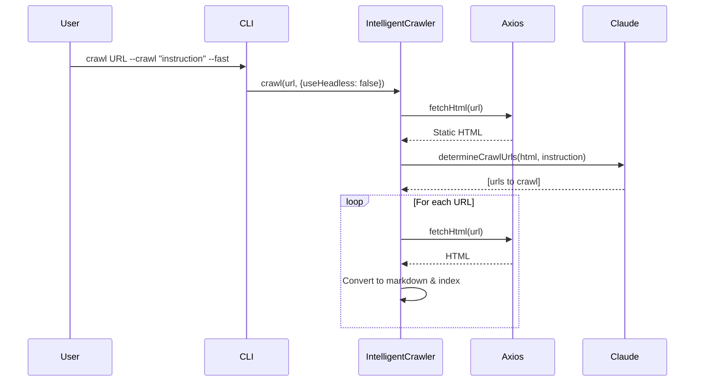

# Crawler Architecture

The crawler defaults to **headless mode** (Playwright) for maximum compatibility with modern JavaScript-rendered sites. Use `--fast` for static HTML sites when speed is critical.

## Default Mode (Headless - JavaScript-Rendered Sites)

By default, the crawler uses Playwright via crawl4ai to render JavaScript content:

## Fast Mode (Static Sites - `--fast`)

For static HTML sites, use `--fast` for faster crawling with axios:

---

## Key Points

| Feature | Description |
|---------|-------------|
| **Default to headless** | Maximum compatibility with modern JavaScript-rendered sites (React, Vue, Next.js) |
| **Fast mode available** | Use `--fast` for static HTML sites when speed is critical |
| **Intelligent crawling preserved** | Claude Code CLI analyzes pages and selects URLs in both modes |
| **Fail-fast behavior** | No silent fallback - errors throw immediately for visibility |

---

## Intelligent Mode vs Simple Mode

The crawler operates in two modes depending on Claude Code CLI availability:

| Mode | Requires Claude CLI | Behavior |
|------|---------------------|----------|
| **Intelligent** | Yes | Claude analyzes pages and selects URLs based on natural language instructions |
| **Simple (BFS)** | No | Breadth-first crawl up to max depth (2 levels) |

**Requirements:**
- Claude Code CLI is required for `--crawl` and `--extract` instructions
- If Claude Code CLI is unavailable, throws an error with installation instructions

> **Note:** Install Claude Code to use intelligent crawling with `--crawl` (AI-guided URL selection) and `--extract` (AI content extraction). The `--simple` flag can be used for basic BFS crawling without Claude Code.
